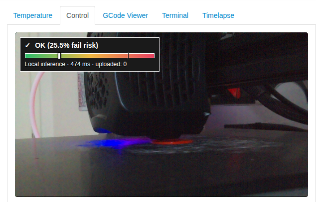
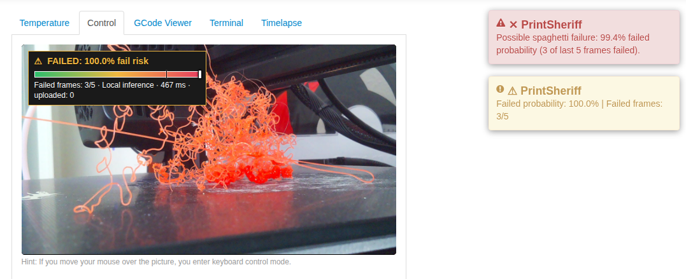
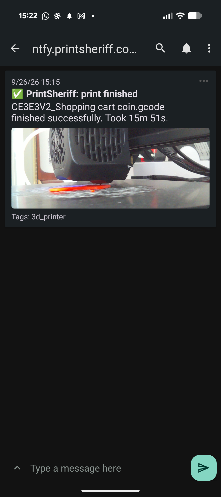
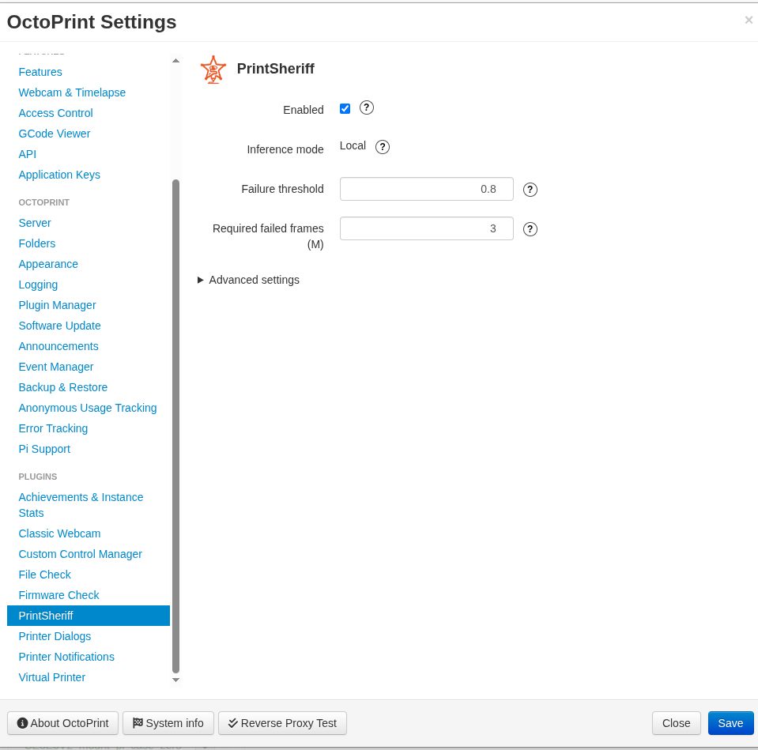
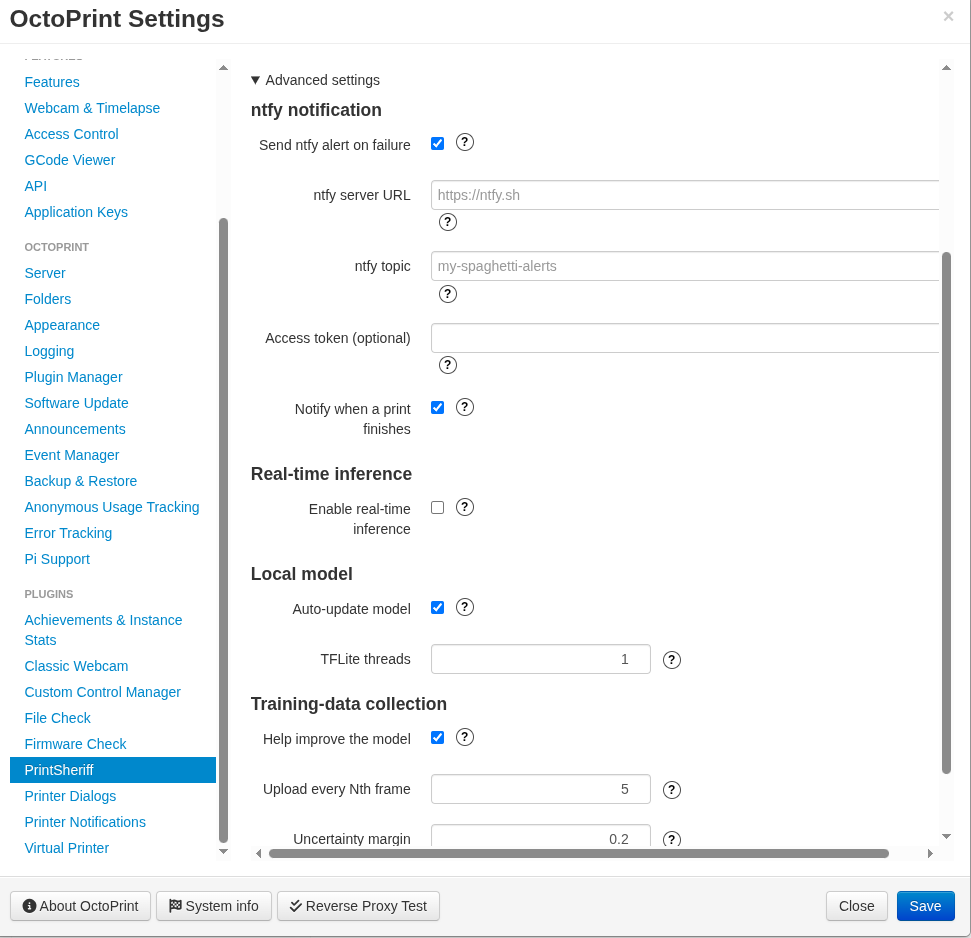

# OctoPrint PrintSheriff

<p align="center">
  
</p>

Classifies every OctoPrint `CaptureDone` timelapse image and raises a persistent OctoPrint warning
plus `M117 Spaghetti detected` after the configured number of consecutive failed predictions.

Inference runs locally on the OctoPrint host with TensorFlow Lite, so detection keeps working
offline when a model is already cached. The plugin contacts `api.printsheriff.com` to download
model updates, and only sampled frames are uploaded for model improvement when that setting is
enabled. See the [privacy policy](PRIVACY.md) for data-handling details.

## Detection overlay

An overlay on OctoPrint's webcam stream shows the current verdict, the fail-risk probability and
the inference time of the last frame. While everything is fine it stays green:



Once the required number of frames in the recent window are classified as failed, the overlay
turns to `FAILED`, OctoPrint raises a persistent warning and `M117 Spaghetti detected` is sent to
the printer:



## Installation

Install through OctoPrint's **Plugin Manager > Get More... > ... from URL** with:

```
https://github.com/xeonqq/octoprint_printsheriff/archive/master.zip
```

or with pip on the OctoPrint host:

```bash
pip install https://github.com/xeonqq/octoprint_printsheriff/archive/master.zip
```

On Raspberry Pi / OctoPi, `numpy` is installed from piwheels and dynamically links against the
system OpenBLAS library. If the plugin fails to load with
`ImportError: libopenblas.so.0: cannot open shared object file`, install it first:

```bash
sudo apt-get update && sudo apt-get install -y libopenblas0-pthread
```

(use `libopenblas0` if `libopenblas0-pthread` is unavailable on your OS release), then restart
OctoPrint.

`tflite-runtime` does not publish wheels for every Python version and architecture. Where it
cannot be installed, install full TensorFlow instead — the plugin imports
`tflite_runtime.interpreter` first and falls back to `tensorflow.lite`.

Restart OctoPrint. In **Settings > PrintSheriff**, enable the plugin. The model is downloaded
from `https://api.printsheriff.com` automatically. Once cached, no server is needed for local
inference.

**Timelapse must be enabled** in **Settings > Webcam & Timelapse** (type `Timed` or `On Z Change`,
not `Off`). The plugin only evaluates frames on OctoPrint's `CaptureDone` event, so with timelapse
capture off it never receives an image and never shows a probability — this is the most common
reason for no feedback during a print.

The plugin does not pause or cancel prints automatically.

## Model distribution

On startup, on settings save, and at the start of every print the plugin calls
`GET /v1/model/metadata` and re-downloads `GET /v1/model` only when the sha256 changed. The model
and its metadata are cached in the plugin's data folder, and the download is checksum-verified
before it replaces the previous copy.

The crop fraction used during training is carried in the metadata, so on-device preprocessing
stays aligned with the model automatically, with no setting to configure.

If no model can be obtained, the plugin **fails closed**: detection is disabled and a notification
explains why.

## Training-data collection

Uploading is **disabled by default (opt-in)**. You can enable **Help improve the model** during
the first-run setup wizard or in **Settings > PrintSheriff** to contribute anonymous training
captures and help improve failure detection accuracy for everyone. Images are kept for 14 days,
then deleted. When enabled, a frame is uploaded to `POST /v1/collect` when **either** condition
holds:

- it is the every-Nth frame of the print (default: every **5th**), or
- the prediction is uncertain, i.e. within the **uncertainty margin** of the failure threshold
  (default: **0.2**).

Uncertain frames are the most valuable for retraining, which is why they are collected regardless
of the sampling interval. Uploads carry the locally computed probability and `source=local_plugin`,
both of which end up in the stored filename.

Uploads are best effort: a failure is logged and never interrupts failure detection. There is no
retry buffer, so frames captured while the server is down are not collected.

## Capturing the finish photo before the presentation move

Many slicer end G-code profiles move the bed or gantry forward to "present" the finished print
before the print job is reported done, so a naive last-frame capture can end up showing the moved
bed instead of the print. No slicer configuration is needed to avoid this: the plugin watches the
outgoing gcode stream via the `octoprint.comm.protocol.gcode.queuing` hook and keeps refreshing a
webcam snapshot only while the printer is actually extruding (throttled to once every few seconds).
Extrusion always stops before a presentation move, so that snapshot naturally freezes on a frame
from right around when printing really finished, and it takes priority over the regular timelapse
capture for the print-done ntfy notification.

<p align="center">
  
</p>

## Settings

The main settings page covers the detection behaviour:



**Advanced settings** holds ntfy notifications, real-time inference, the local model and
training-data collection:



| Setting | Default | Purpose |
| --- | --- | --- |
| Enabled | `true` | Process timelapse captures. |
| Request timeout (seconds) | `10` | Applies to model downloads and uploads. |
| Failure threshold | `0.8` | Probability at or above which a frame counts as failed. |
| Required failed frames (M) | `3` | Failed frames required, within a slightly larger recent window, before alerting. The window size is derived automatically as `M + max(2, ceil(M / 2))` — not a separate setting — so stricter (lower) M values aren't punished with disproportionately little tolerance for occasional flips. |
| Send ntfy alert on failure | `false` | Send push notification with capture when failure is detected. |
| ntfy server URL | `https://ntfy.sh` | ntfy instance URL (`https://ntfy.sh` or self-hosted). |
| ntfy topic | _empty_ | ntfy topic name to publish alerts to. |
| Access token | _empty_ | Optional Bearer token for protected ntfy topics. |
| Notify when a print finishes | `true` | Send a completion notification with the final timelapse capture when available. |
| Auto-update model | `true` | Check for a new model at startup and each print start. |
| TFLite threads | `1` | Interpreter thread count. |
| Help improve the model | `false` | Send sampled frames for retraining (opt-in). |
| Upload every Nth frame | `5` | Regular sampling interval for uploads. |
| Uncertainty margin | `0.2` | Band around the threshold that always uploads. |

A good frame resets the consecutive count, so the warning is sent once for each continuous failure
sequence.

## Package layout

| Module | Purpose |
| --- | --- |
| `__init__.py` | The plugin: settings, event handling, capture worker. |
| `detection.py` | `DetectionState` — M-out-of-N sliding window state machine with one-shot alerting. |
| `server_client.py` | `InferenceServerClient` — stdlib client for `/v1/collect`, `/v1/model`. |
| `preprocessing.py` | Image preprocessing, shared with model training. |
| `tflite_runner.py` | `TFLiteRunner` — interpreter with quantization handling. |
| `model_sync.py` | `ModelSync` — checksum-verified model download and cache. |
| `upload_policy.py` | `should_upload()` — which frames to collect. |
| `ntfy_notifier.py` | Sends ntfy push notifications with the failure capture attached. |

Preprocessing is Pillow-based rather than OpenCV-based so the plugin stays installable on a
Raspberry Pi.

## License

Licensed under the [GNU Affero General Public License v3.0 or later](LICENSE), the same license
as OctoPrint itself.

